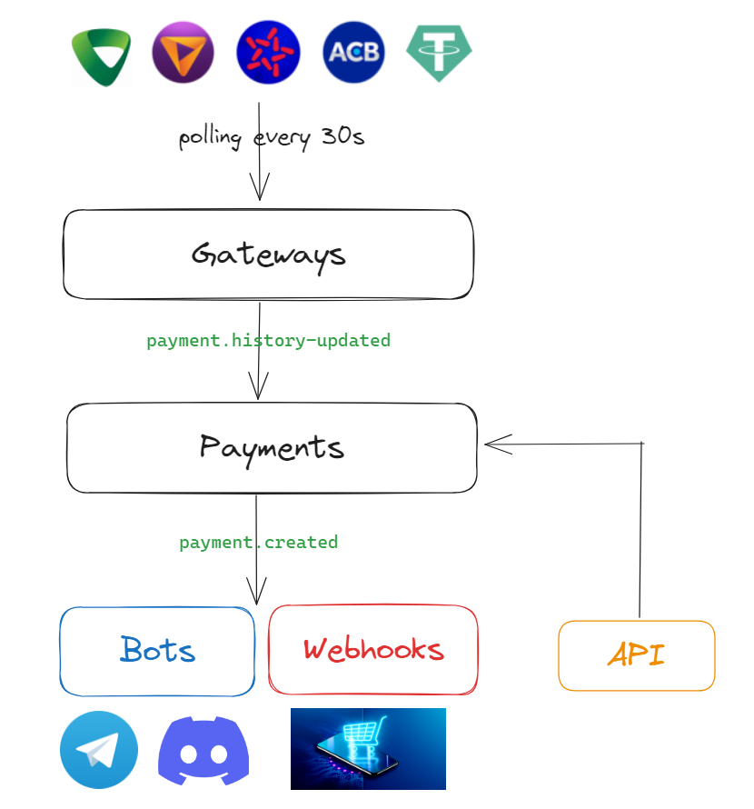

# Payment service

- Nguồn: https://gitlab.com/nhayhoc/payment-service
# Mục đích

- Free 100%

- Open source, self host, sử dụng api gốc của ngân hàng.

- Bảo mật thông tin giao dịch và thông tin đăng nhập ngân hàng.

- Thông báo qua telegram, discord.

- Gửi webhook để các service khác cộng số dư cho user.

- API danh sách giao dịch.

- Không giới hạn số lượng giao dịch.

- Cài đặt đơn giản: sửa file config, chạy lệnh docker-compose up.

- Source có khả năng thêm các cổng thanh toán tuỳ chỉnh dễ dàng.

- Sử dụng bullmq đảm bảo webhook, thông báo được gửi đi.

- Ngân hàng hỗ trợ:
  - VCB Bank: Full API
  - TP Bank: Full API
  - MB Bank: Lấy lịch sử qua API, Đăng nhập qua headless browser
  - ACB Bank: Lấy lịch sử qua API, Đăng nhập qua headless browser
  - USDT (Tron, Bep20): Full API



# Cài đặt

## Hỗ trợ

- Docker in Ubuntu
- Docker in window (wsl2)
- NOT support Docker in mac os (need someone to fix it)
- Other os: (no test yet)

## Cài đặt cơ bản

### Bước 1: Cài đặt docker và docker-compose trên máy chủ

[https://www.digitalocean.com/community/tutorials/how-to-install-and-use-docker-on-ubuntu-20-04](https://www.digitalocean.com/community/tutorials/how-to-install-and-use-docker-on-ubuntu-20-04)

[https://docs.docker.com/desktop/install/windows-install/](https://docs.docker.com/desktop/install/windows-install/)

[https://www.digitalocean.com/community/tutorials/how-to-install-and-use-docker-compose-on-ubuntu-20-04](https://www.digitalocean.com/community/tutorials/how-to-install-and-use-docker-compose-on-ubuntu-20-04)

### Bước 2: Cấu trúc thư mục

```javascript

├── .docker/
│   └── config/
│       └── config.yml
├── docker-compose.yml
```

Lỗi đã biết:

- Có thể báo lỗi không có quyền đọc file config.yml, vui lòng cấp quyền đọc

### Bước 3: Tạo file `docker-compose.yml`

```yml
version: '3'
volumes:
  redis-data:
    driver: local
services:
  app:
    image: registry.gitlab.com/nhayhoc/payment-service
    volumes:
      - ./.docker/config/config.yml:/app/config/config.yml
    ports:
      - 3000:3000
    depends_on:
      - redis
      - captcha-resolver
    environment:
      - PORT=3000
      - REDIS_HOST=redis
      - REDIS_PORT=6379
      - CAPTCHA_API_BASE_URL=https://bank-captcha.payment.com.vn
      # If want self-hosted captcha server, edit CAPTCHA_API_BASE_URL to your service
      # CAPTCHA_API_BASE_URL to http://captcha-resolver:1234
      
      # If need config for webhook telegram, where DOMAIN Telegram will make HTTP Post
      # SERVICE_DOMAIN=
  redis:
    image: redis:6.2-alpine
    volumes:
      - redis-data:/data
  # If want self-hosted captcha server, remove comment
  # captcha-resolver:
  #  image: registry.gitlab.com/nhayhoc/bank-captcha-server
```

### Bước 4: Tạo file `.docker/config/config.yml`

```yml
# Xem file hoàn chỉnh tại ./config/config.example.yml
bots:
  # Hướng dẫn cài bot ở phía dưới
proxies:
  # Hướng dẫn cài proxies ở phía dưới
webhooks:
  # Hướng dẫn cài webhook ở phía dưới
gateways:
  mb_bank_1:
    type: "MBBANK"
    password: "bank password" 
    account: "stk nhan tien"
    login_id: "ten dang nhap bank"
    repeat_interval_in_sec: 20
  # vcb_bank_1:
  #   type: 'VCBBANK'
  #   password: 'bank password'
  #   account: 'stk nhan tien'
  #   login_id: 'ten dang nhap'
  #   device_id: 'huong dan lay phia duoi'
  #   repeat_interval_in_sec: 20
  #   proxy: 'proxy_1'


```

Giải thích:

| Field                               | Description                                                                                                                                                                                                                   |
|-------------------------------------|-------------------------------------------------------------------------------------------------------------------------------------------------------------------------------------------------------------------------------|
| `gateways`                          |                                                                                                                                                                                                                               |
| &nbsp;&nbsp;`mb_bank_1`             | Tên gateway, đặt tuỳ ý.                                                                                                                                                                                                       |
| &nbsp;&nbsp;`type`                  | `VCBBANK` \| `MBBANK` \| `ACBBANK`  \| `TPBANK` \| `TRON_USDT_BLOCKCHAIN`  \| `BEP20_USDT_BLOCKCHAIN`.                                                                                                                                                    |
| &nbsp;&nbsp;`password`              | Pass login bank. Nếu dùng bep20 usdt thì điền api token bscscan.                                                                                                                                           |
| &nbsp;&nbsp;`account`               | STK nhận tiền hoặc địa chỉ ví tron.                                                                                                                                                                                            |
| &nbsp;&nbsp;`login_id`              | User đăng nhập bank.                                                                                                                                                                                                           |
| &nbsp;&nbsp;`repeat_interval_in_sec`| Thời gian polling lịch sử, đơn vị giây.                                                                                                                                                                                        |
| &nbsp;&nbsp;`device_id`             | ID browser mà bạn đã từng login thành công. Việc này giúp hạn chế yêu cầu nhập lại OTP hoặc thực hiện xác thực khuôn mặt khi payment-service login.                                                                            |
| &nbsp;&nbsp;`proxy`                 | Tên proxy (nếu có).                                                                                                                                                                                                            |
| &nbsp;&nbsp;`get_transaction_count_limit` | (Mặc định 100) Giới hạn số lượng giao dịch khi call api bank (Bank support: TP Bank, VCB).                                                                                                                                    |
| &nbsp;&nbsp;`get_transaction_day_limit`  | (Mặc định 14) Số ngày tính từ hiện tại về trước. (Bank support: VCB, TPBank, ACB, MB Bank). Ví dụ hôm nay là 30/7, get_transaction_day_limit=14 => lấy giao dịch từ 16/7 tới 30/7.                                          |

### Bước 5: Chạy lệnh `docker-compose up -d`

### NOTE

- Hãy đảm bảo **đúng thông tin đăng nhập** trước khi nhập vào service, tránh service spam dẫn tới bị khoá IP/account
- Vào cài đặt ngân hàng tương ứng, tìm **tắt 2fa**.
- TP Bank, VCB yêu cầu phải có `device_id`, đọc mục hướng dẫn lấy device_id để biết thêm chi tiết.

| Bank Name | LOGIN URL                                                      |
|-----------|----------------------------------------------------------|
| MB Bank   | [https://online.mbbank.com.vn/pl/login](https://online.mbbank.com.vn/pl/login) |
| ACB       | [https://acb.com.vn/](https://acb.com.vn/)               |
| TPBank    | [https://ebank.tpb.vn/retail/vX/](https://ebank.tpb.vn/retail/vX/) |
| Vietcombank | [https://vcbdigibank.vietcombank.com.vn/auth](https://vcbdigibank.vietcombank.com.vn/auth) |

## Proxy

Hiện support các proxy có dạng host:port tĩnh, và có thể xoay thông qua url, vd mproxy.vn.

```yml
proxies:
  proxy_1:
    schema: 'http'
    ip: 'ip.mproxy.vn'
    port: '12343'
    username: 'username'
    password: 'key-pass'
    change_url: 'https://mproxy.vn/capi/token/key/key-pass/resetIp'
    change_interval_in_sec: 1800
```

## Hướng dẫn lấy device_id

Cần lấy device_id của browser mà bạn đã từng login thành công. Việc này giúp hạn chế yêu cầu nhập lại OTP hoặc thực hiện xác thực khuôn mặt khi payment-service login.

### VCB

B1: Cho phép login từ trình duyệt

Mở app vcb > quản lí đăng nhập kênh > Bật "cài đặt đăng nhập vcb trên web", Tắt "xác thực đăng nhập vcb trên web"

B2: Mở trình duyệt, đăng nhập tại [https://vcbdigibank.vietcombank.com.vn/auth](https://vcbdigibank.vietcombank.com.vn/auth), xác nhận otp, khuân mặt (nếu có)

B3: Vào link sau: [https://payment.com.vn/get-vcb-device-id.html](https://payment.com.vn/get-vcb-device-id.html) để lấy device_id

### TP Bank

B1: Mở trình duyệt đã xác minh khuân mặt

B2: Vào trang [https://ebank.tpb.vn/retail/vX/](https://ebank.tpb.vn/retail/vX/)

B2: Bấm f12, tab console, paste đoạn code sau:

```javascript
localStorage.deviceId
```

## Bot

Thêm đoạn code như sau vào file `./config/config.yml`

```yml
bots:
  notification_telegram_bot:
    type: "TELEGRAM"
    token: "6857216324:AAGFc28G9i3733qdVMuciEyqonh-TF12zKI"
    chat_chanel_id: "6862724379"
    conditions:
      content_regex: ".*?"
      account_regex: ".*?"
    # only support in telegram
    # admin_ids can use /stopCron command
    admin_ids:
      - "6862724379" 
```

| Field             | Description                                                                                   | Example                                                              |
|-------------------|-----------------------------------------------------------------------------------------------|----------------------------------------------------------------------|
| `type`            | Loại bot (`TELEGRAM` hoặc `DISCORD`).                                                         | `TELEGRAM`                                                           |
| `token`           | Token của bot.                                                                                | `6857216324:AAGFc28G9i3733qdVMuciEyqonh-TF12zKI`                     |
| `chat_channel_id` | ID của kênh chat mà bot sẽ gửi thông báo.                                                     | `6862724379`                                                         |
| `conditions`      | Điều kiện để bot gửi thông báo.                                                               |                                                                      |
| &nbsp;&nbsp;`content_regex` | Regex kiểm tra nội dung tin nhắn.                                                             | `.*?` (chấp nhận mọi tin nhắn)                                       |
| &nbsp;&nbsp;`account_regex` | Regex kiểm tra số tài khoản trong tin nhắn.                                                   | `.*?` (chấp nhận mọi số tài khoản)                                   |
| `admin_ids`       | Danh sách ID của người dùng có quyền sử dụng lệnh `/stopCron` để dừng bot (chỉ hỗ trợ Telegram). | `6862724379` (ID của người dùng có quyền dừng bot)                   |

### Telegram

#### **Step 1 - Tạo Telegram Bot**

Tạo bot mới với [BotFather](https://t.me/BotFather) và copy token

#### **Step 2 - Lấy chat id**

Dùng [Message Tool](https://irgendwr.github.io/TelegramAlert/message-tool) để tìm chatid của mình

NOTE: Nếu muốn bot gửi tin nhắn vào group, hãy tắt privacy mode, và thêm bot vào group, cho phép bot có quyền gửi tin nhắn.

#### Step 3 - Cài đặt

```yml
bots:
  notification_telegram_bot:
    type: "TELEGRAM"
    token: "6857216324:AAGFc28G9i3733qdVMuciEyqonh-TF12zKI" # thay bằng token ở step 1
    chat_chanel_id: "6862724379" # thay bằng chat id ở step 2
    conditions:
      content_regex: ".*?"
      account_regex: ".*?"
    # only support in telegram
    # admin_ids can use /stopCron command
    admin_ids:
      - "6862724379" # thay bằng user id ở step 2
```

### Bot discord

Vào kênh cần nhận thông báo, tạo webhook, bấm sao chép url webhook

```javascript
https://discord.com/api/webhooks/1189585904591982673/7kM-0WURzVYkf5Tv2Rs1Un1rfMDWIHwsVNCC6YTvkK-P1XhTc_nf3Xcw0URf8Ynsbmd9
```

==> từ URL vừa copy trên discord, ta lấy được chatid và token.

Chatid: `1189594424070639667`

Token: `7kM-0WURzVYkf5Tv2Rs1Un1rfMDWIHwsVNCC6YTvkK-P1XhTc_nf3Xcw0URf8Ynsbmd9`

```javascript
bots:
  notification_discord_bot:
    type: "DISCORD"
    token: "7kM-0WURzVYkf5Tv2Rs1Un1rfMDWIHwsVNCC6YTvkK-P1XhTc_nf3Xcw0URf8Ynsbmd9"
    chat_chanel_id: "1189585904591982673"
    conditions:
      content_regex: ".*?"
      account_regex: ".*?"
```

## Stop

Trong trường hợp bạn cần đăng nhập vào bank trên đt, mà payment-service cũng đăng nhập vào khiến bạn bị văng ra, thì hãy chat như sau với con bot tele, nó sẽ dừng 5p cho bạn có time chuyển tiền đi. Hoặc call api như sau

```javascript
http://localhost:3000/payments/stop-gate?name=mb_bank_1&time_in_sec=600
```

## Webhook cho web của bạn

Với config sau

```javascript
webhooks: 
  test_webhook:
    url: "http://localhost:3001/api/payment/callback"
    token: "123456789:ABCDEF"
    conditions:
      content_regex: ".*?"
      account_regex: ".*?"
```

Server web sẽ nhận được

```javascript
const express = require("express");
const app = express();
app.use(express.json());

app.post("/api/payment/callback", (req, res) => {
  const data = req.body; 
  console.log(data); // token là do bạn config ở phần webhook, payment là thông tin giao dịch
  //   {
  //     token: '123456789:ABCDEF',
  //     payment: {
  //       transaction_id: 'tbbank-15401929546',
  //       amount: 5000000,
  //       content: 'nap 323523',
  //       date: '2021-06-19T17:00:00.000Z',
  //       account_receiver: '04381598888',
  //       gate: 'TPBANK'
  //     }
  //   }
  res.status(200).send("Data received");
});
app.listen(3001, () => {
  console.log("Server running on port 3001");
});


```

## API

Lấy danh sách giao dịch: `http://localhost:3000/payments`
Dừng service: `http://localhost:3000/payments/stop-gate?name=mb_bank_1&time_in_sec=600`

## Tùy chọn thêm

## Mở rộng

- Thêm bất cứ loại giao dịch hay cổng thanh toán nào, emit event `payment.history-updated`
- Lắng nghe có giao dịch mới, `@OnEvent("payment.created")`

## Hướng dẫn đóng góp

### Chạy dự án

Khởi chạy redis và server giải captcha

`docker-compose -f docker-compose.dev.yml up -d`

Install package
`pnpm install`

Install playwright
`pnpm playwright install`

Tạo file .env

```
PORT=3001
REDIS_HOST=localhost
REDIS_PORT=6380
CAPTCHA_API_BASE_URL=http://localhost:1234
# If need disable sync payment data to redis
# DISABLE_SYNC_REDIS=true
```

Tạo file `config/config.yml`

```yml
bots:
webhooks:
gateways:
  your_bank_1:
    type: 'YOUR_TYPE'
    password: '--'
    login_id: '--'
    account: '--'
    repeat_interval_in_sec: 20
```

Chạy `pnpm run start:dev`

Lưu ý, các lịch sử giao dịch cũ sẽ được cache trong redis, để xoá chúng hãy làm bước sau:

- Tắt app
- Chạy lệnh `docker-compose exec redis redis-cli flushall`
- Mở lại app

### Thêm cổng thanh toán

- Tạo thêm file mới `/gateways/gateway-factory/yourgateway.services.ts`

```ts
+ import { GateType, Payment } from '../gate.interface';
+ import { Gate } from '../gates.services';
+ 
+ export class YourGatewayService extends Gate {
+   async getHistory(): Promise<Payment[]> {
+     // your code here
+     return ...
+   }
+ }
```

- Sửa `src\gateways\gate.interface.ts`

```ts
export enum GateType {
   MBBANK = 'MBBANK',
+  YOUR_TYPE = 'YOUR_TYPE'
}
```

- Sửa factory gateway `src/gateways/gateway-factory/gate.factory.ts`

```ts

    switch (config.type) {
+      case GateType.YOUR_TYPE:
+        const yourbank = new YourGatewayService(config, eventEmitter, captchaSolver);
+        return yourbank;
```

- Cập nhật validate `src/gateways/gates-manager.services.ts`

```ts
      login_id: Joi.string().when('type', {
-       is: [GateType.ACBBANK, GateType.MBBANK, GateType.TPBANK],
+       is: [GateType.ACBBANK, GateType.MBBANK, GateType.YOUR_TYPE],
        then: Joi.required(),
      }),
```

# Bản quyền

- Mã nguồn của dịch vụ này được công khai, cho phép bất kỳ ai xem, sửa đổi, và cải thiện nó.
- Được phép sử dụng vào mục đích thương mại: tạo cổng thanh toán cho website, thông báo giao dịch cho nhân viện của hàng,...

# Miễn trừ trách nhiệm

- **Miễn Trừ Trách Nhiệm Pháp Lý**: Người phát triển mã nguồn không chịu trách nhiệm pháp lý cho bất kỳ thiệt hại hay tổn thất nào xuất phát từ việc sử dụng hoặc không thể sử dụng dịch vụ.

- **Sử Dụng API Ngân Hàng Không Chính Thức**: Dịch vụ này hiện đang sử dụng các API của ngân hàng mà không có sự đồng ý chính thức từ các ngân hàng hoặc tổ chức tài chính liên quan. Do đó, người sáng lập và nhóm phát triển:
  - Không chịu trách nhiệm cho bất kỳ vấn đề pháp lý hoặc hậu quả nào phát sinh từ việc sử dụng các API này.
  - Không đảm bảo tính chính xác, độ tin cậy, hoặc tính sẵn có của dữ liệu lấy từ các API này.
  - Khuyến cáo người dùng cần cân nhắc rủi ro pháp lý và an toàn thông tin khi sử dụng dịch vụ.

**Ghi Chú Quan Trọng:**

- Việc sử dụng các API không chính thức này có thể vi phạm các quy định pháp lý và chính sách của ngân hàng.
- Chúng tôi khuyến khích người dùng và các bên liên quan cân nhắc kỹ lưỡng trước khi sử dụng dịch vụ này cho các mục đích tài chính hoặc thanh toán quan trọng.
- Người dùng nên tham khảo ý kiến từ chuyên gia pháp lý hoặc tài chính trước khi đưa ra quyết định dựa trên dữ liệu hoặc dịch vụ được cung cấp qua dịch vụ này.

# Những Người Đóng Góp

Dự án này không thể tồn tại mà không có sự hỗ trợ và cống hiến của cộng đồng. Xin chân thành cảm ơn tất cả những người đã đóng góp vào việc phát triển và cải thiện mã nguồn này.

[@ducmaster](https://gitlab.com/nhayhoc) - Bảo trì dự án

[@chuanghiduoc](https://gitlab.com/chuanghiduoc) - Thêm cổng Tp bank

[@TypicalShavonne](https://gitlab.com/TypicalShavonne) - Chỉnh sửa thông báo discord embed

[@amadeusmz](https://gitlab.com/amadeusmz) - Fix lỗi Tp bank

[@chinhngocpro](https://gitlab.com/chinhngocpro) - Hỗ trợ multi proxy
